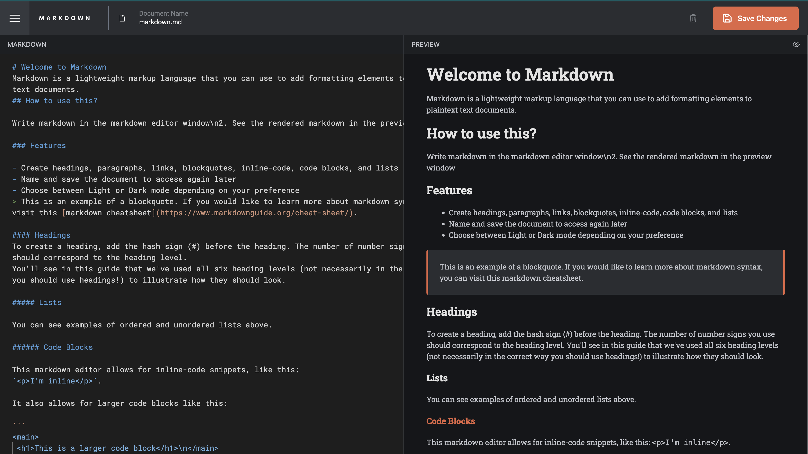
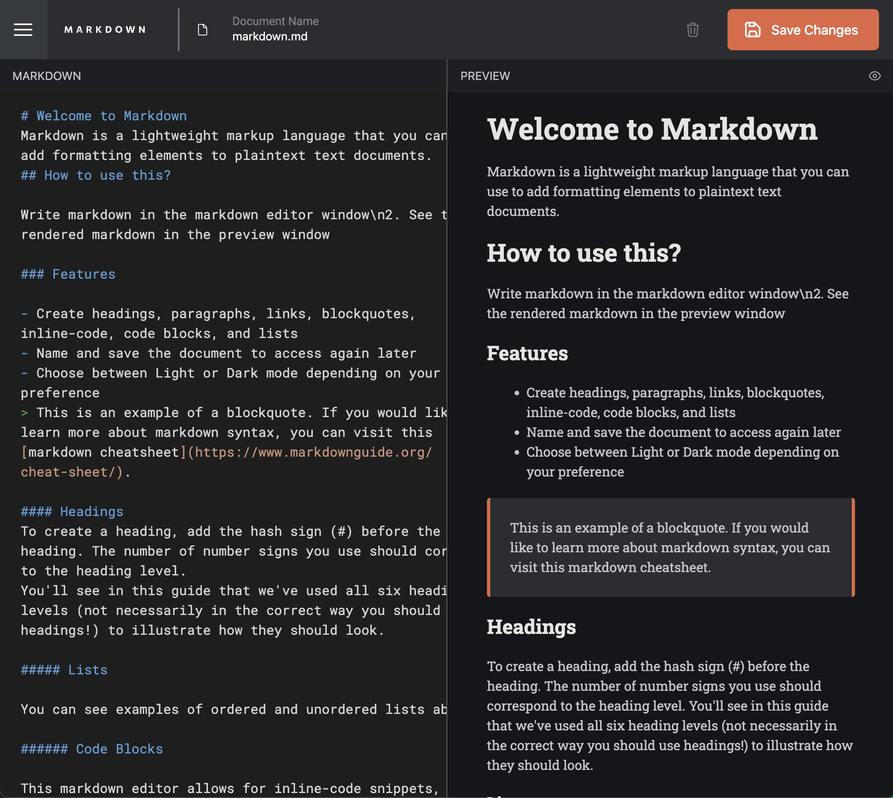
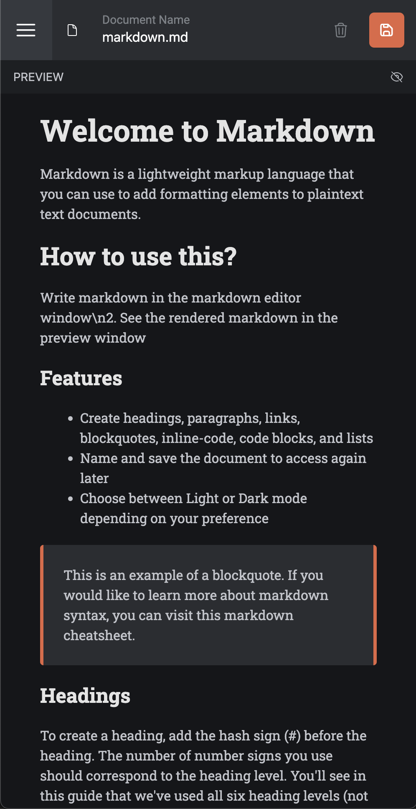

# Frontend Mentor - In-browser markdown editor solution

This is a solution to the [In-browser markdown editor challenge on Frontend Mentor](https://www.frontendmentor.io/challenges/inbrowser-markdown-editor-r16TrrQX9). Frontend Mentor challenges help you improve your coding skills by building realistic projects.
Additionally, I decided to make this the one of my capstone projects for my FrontEnd Coding Bootcamp With Promineo Tech.
Here are the requirements of that:

- Create a full CRUD application of your choice.

- When using an existing API, use AJAX to interact with it.

- Note: You do not have to use an API. If you do not use an API, store the entities you will create, read, update, and delete in an array.

-- Use a form to add new entities
-- Build a way for users to update or delete entities
-- Use Bootstrap and CSS to style your project

## Table of contents

- [Overview](#overview)
  - [The challenge](#the-challenge)
  - [Screenshot](#screenshot)
  - [Links](#links)
- [My process](#my-process)
  - [Built with](#built-with)
  - [What I learned](#what-i-learned)
  - [Continued development](#continued-development)
- [Author](#author)

## Overview

### The challenge

Users should be able to:

- Create, Read, Update, and Delete markdown documents
- Name and save documents to be accessed as needed
- Edit the markdown of a document and see the formatted preview of the content
- View a full-page preview of the formatted content
- View the optimal layout for the app depending on their device's screen size
- See hover states for all interactive elements on the page
- **Bonus**: If you're building a purely front-end project, use localStorage to save the current state in the browser that persists when the browser is refreshed
- **Bonus**: Build this project as a full-stack application

### Screenshot






### Links

- Solution URL: [My Solution](https://github.com/barnettet31/markdown-mern)
- Live Site URL: [Live Site](https://www.travreadz.com/)

## My process
So I actually decided to build this app as a full stack MERN application using nodejs/mongo as my backend and db combo. 

My goal was to first get the user authentication portion down first so I built out a simple signup/sign in form taht would enable me to test that. 

Then after that, I had a means of only making authenticated requests to my web server for user documents and posting updates/deleting documents. 

The styling and the layout was provided by the figma file and was relatively simple. The only really difficult part was the font color on the code editor component that I used. 

I used grid template areas to  define the layout. 
### Built with

- Semantic HTML5 markup
- Flexbox
- CSS Grid
- Mobile-first workflow
- [React](https://reactjs.org/) - JS library
- [NodeJs](https://nodejs.org/en/) - Server
- [PassportJs](https://www.passportjs.org/) - Authentication
- [TailwindCSS](https://tailwindcss.com/) - For styles


### What I learned
I learned how to code up a simple authentication process with HTTP only cookies and how to code up node js middlewares that allow me to control the cors rules for incoming requests! It's honestly very simple considering the cors package that's available on node js. 
```ts
app.use(cors());
//literally just as simple as that. 
```

### Continued development
I think in the future I won't roll my own auth solution as it was very complicated and time consuming. I'm going to learn how to integrate other providers into my apps and use those for the heavy lifting for the auth. 
## Author

- Website - [Travis Barnette](https://www.travcodez.com)
- Website - [LinkedIn](https://www.linkedin.com/in/barnettetravis31/)
- Frontend Mentor - [@barnettet31](https://www.frontendmentor.io/profile/barnettet31)
- Twitter - [@TravCodez](https://www.twitter.com/TravCodez)
- YouTube - [@TravCodez](https://www.youtube.com/channel/UCkwVXYkkGf0ej84_wWpSbvg)
